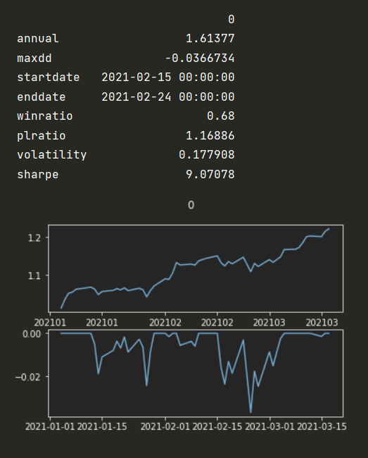

# toy-alpha

Using price and volume, EOD data, to implement a toy alpha-research process.

# gen multi factors

for loop gen several toy factors, and test if alpha or noise. 

when backtest one single factor, focus on factor itself:
- open pos when fac > fac.mean_day, buy tomorrow and sell the day next tomorrow, weighted as factor exposure.
- pnl is net pnl, subtracted from index (all market).
- auto set reversal or trending
- no fee

Based on results, delete noise factors which pnl is negative.

> break data into train and test dataset, split from 2021-01-01.

# modeling

To simplify, using Lasso Regression to combine these factors.

X as multi factor values (only efficient factors), y as returns (buy tomorrow, sell day next tomorrow).

# outsample backtest

To test our signal outsample, set strategy: 
- buy stocks, whose signal > 90%, even weighted.
- buy tomorrow and sell the day next tomorrow
- no fee

Here is strategy performance:

--

Here is benchmark (buying whole market):

## results
bravo! outsample return is 1.70654, and benchmark return is 1.61377. We beat the benchmark over 9.3%.

# Conclusion

It's one simple model but show whole alpha research process.

There are several things could be improved:
- gen multi factors could using models to auto mining, like Genetic Programming, AlphaNet. 
- combination could use non-linear models, like NN and Ensemble learning.
- could add more variables, bar or even L2 data, alternative data and so on.

